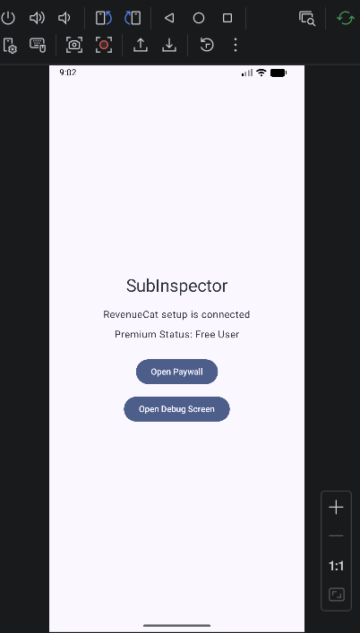
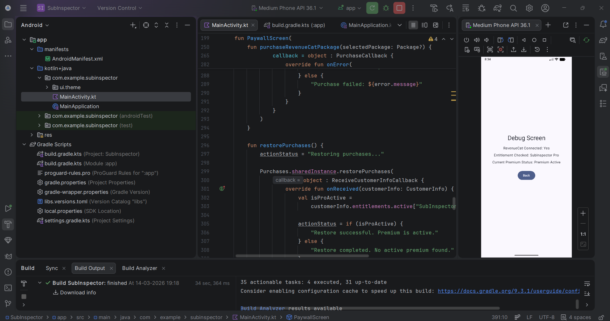
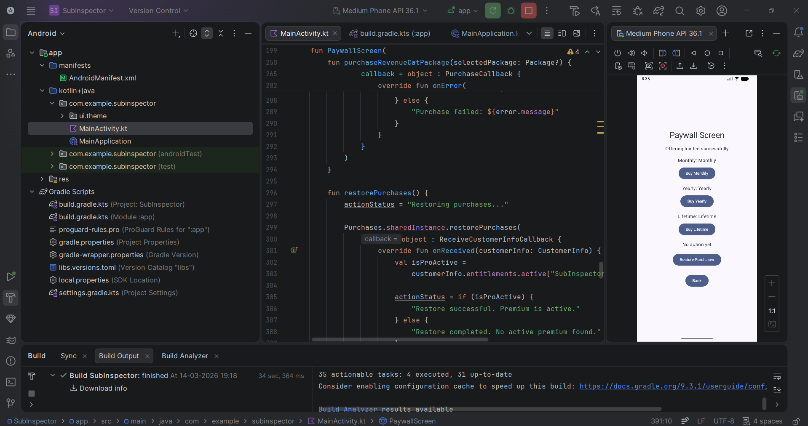
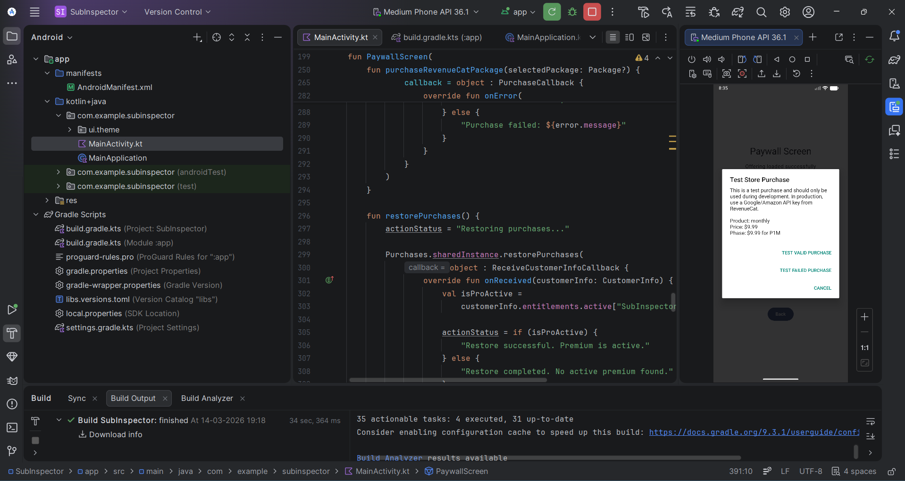
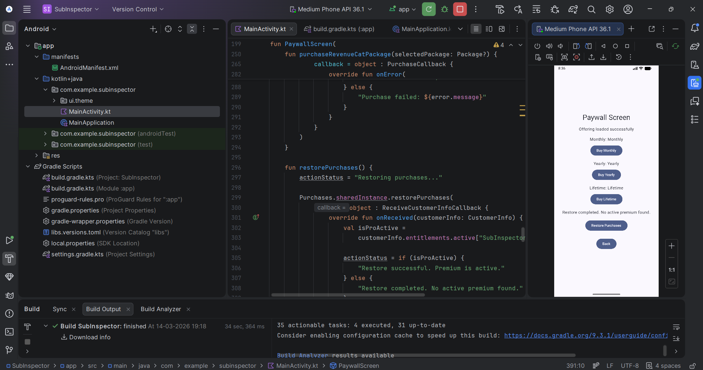
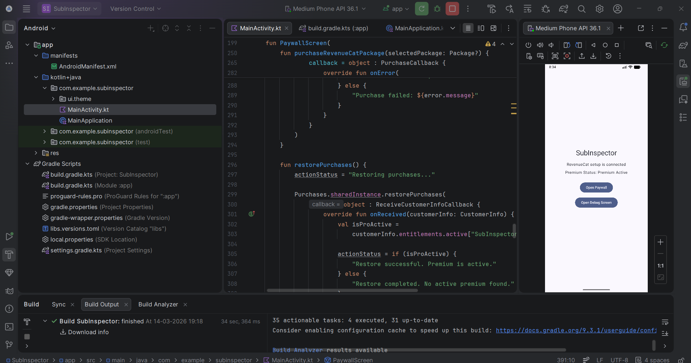

# SubInspector

SubInspector is a simple Android app built with Kotlin and Jetpack Compose to demonstrate RevenueCat subscription integration.

This project shows a clean paywall flow with Monthly, Yearly, and Lifetime packages, purchase handling, restore purchases, and premium status checking.

## Features

- RevenueCat SDK integration
- Monthly, Yearly, and Lifetime subscription options
- Purchase flow handling
- Restore purchases support
- Premium entitlement status check
- Clean Jetpack Compose UI

## Screenshots

### Home Screen

### Debug Screen

### Paywall Screen

### Purchase Success

### Restore No Premium

### Premium Active

## Tech Stack

- Kotlin
- Jetpack Compose
- RevenueCat SDK
- Android Studio

## Project Purpose

This project was created as a practical demo to understand and showcase subscription integration in an Android application using RevenueCat.

## Notes

- This project currently uses RevenueCat test configuration
- Screenshots are added for project presentation
- Intended for learning, demo, and portfolio purposes